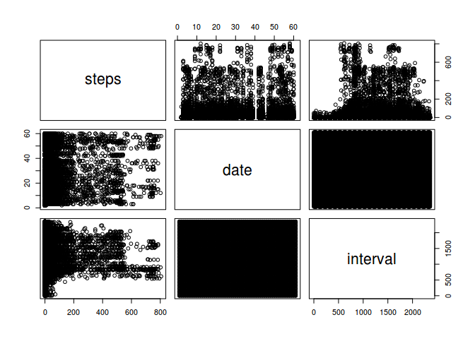
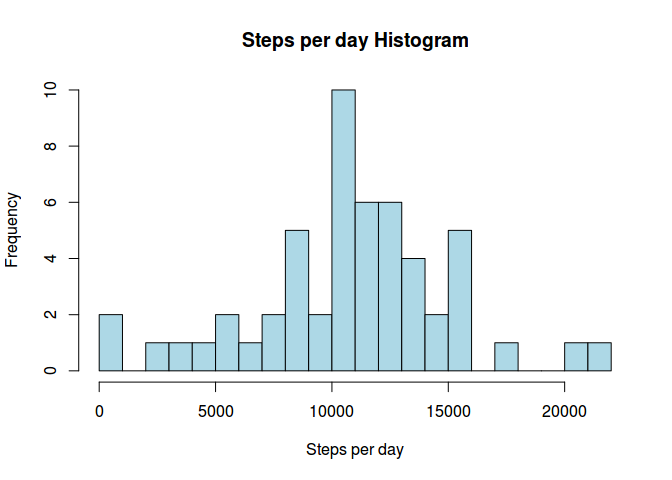
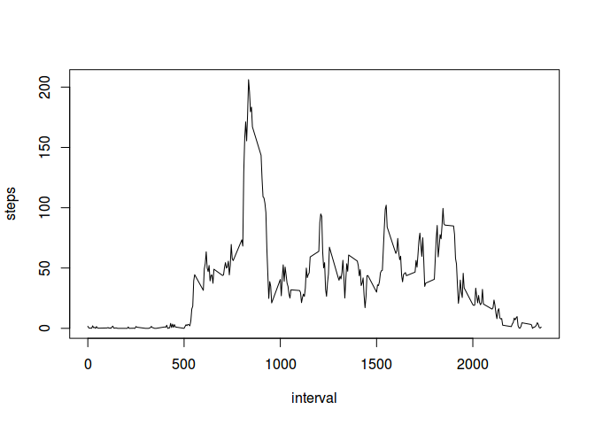
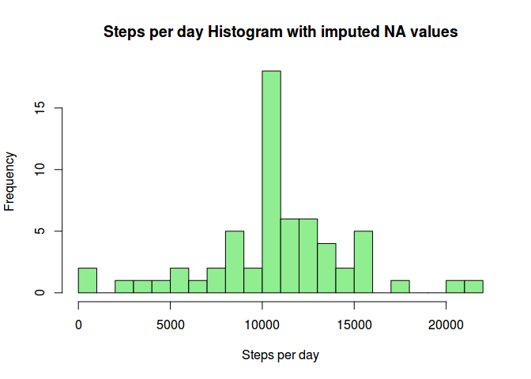
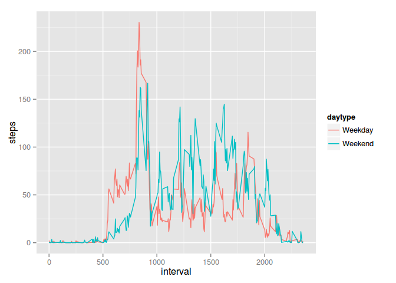

# Reproducible Research: Peer Assessment 1
Geert  
September 09, 2015  


## Loading and preprocessing the data


```r
activity <-read.csv("activity.csv")
head(activity)
```

```
##   steps       date interval
## 1    NA 2012-10-01        0
## 2    NA 2012-10-01        5
## 3    NA 2012-10-01       10
## 4    NA 2012-10-01       15
## 5    NA 2012-10-01       20
## 6    NA 2012-10-01       25
```

```r
summary(activity)
```

```
##      steps                date          interval     
##  Min.   :  0.00   2012-10-01:  288   Min.   :   0.0  
##  1st Qu.:  0.00   2012-10-02:  288   1st Qu.: 588.8  
##  Median :  0.00   2012-10-03:  288   Median :1177.5  
##  Mean   : 37.38   2012-10-04:  288   Mean   :1177.5  
##  3rd Qu.: 12.00   2012-10-05:  288   3rd Qu.:1766.2  
##  Max.   :806.00   2012-10-06:  288   Max.   :2355.0  
##  NA's   :2304     (Other)   :15840
```

The dataframe "activity" looks OK as it is, so no further preprocessing is necessary

Let's have a quick look at the data as it is:


```r
plot(activity)
```

 


## What is mean total number of steps taken per day?

Group data by date and sum the number of steps taken each day.
Show a histogram of the number of total steps taken each day and calculate the mean and median of the total number of steps taken each day:


```r
suppressMessages(library(dplyr))
by_date <- group_by(activity,date)
by_date <- summarise(by_date, steps=sum(steps))
head(by_date)
```

```
## Source: local data frame [6 x 2]
## 
##         date steps
## 1 2012-10-01    NA
## 2 2012-10-02   126
## 3 2012-10-03 11352
## 4 2012-10-04 12116
## 5 2012-10-05 13294
## 6 2012-10-06 15420
```

```r
hist(by_date$steps, breaks = 20, col = "lightblue", main = "Steps per day Histogram", xlab = "Steps per day")
```

 

```r
summary(by_date)
```

```
##          date        steps      
##  2012-10-01: 1   Min.   :   41  
##  2012-10-02: 1   1st Qu.: 8841  
##  2012-10-03: 1   Median :10765  
##  2012-10-04: 1   Mean   :10766  
##  2012-10-05: 1   3rd Qu.:13294  
##  2012-10-06: 1   Max.   :21194  
##  (Other)   :55   NA's   :8
```


## What is the average daily activity pattern?

ake a time series plot of the average of the number of steps taken each 5 minute interval, averaged over all days, and show the 5 minute interval that contains the maximum number of steps on average across all the days in the dataset


```r
by_interval <- group_by(activity, interval)
by_interval <- summarise(by_interval, steps = mean(steps, na.rm = TRUE))
head(by_interval)
```

```
## Source: local data frame [6 x 2]
## 
##   interval     steps
## 1        0 1.7169811
## 2        5 0.3396226
## 3       10 0.1320755
## 4       15 0.1509434
## 5       20 0.0754717
## 6       25 2.0943396
```

```r
plot(by_interval, type = "l")
```

 

Interval of maximum steps averaged across all days:


```r
filter(by_interval, steps == max(steps))
```

```
## Source: local data frame [1 x 2]
## 
##   interval    steps
## 1      835 206.1698
```


## Imputing missing values

Number of missing values in this file : 2304 (this is calculated with R inline code sum(is.na(activity$steps)))

The NA values will be replaced by the mean number of steps per day in the same interval.  This mean value has already been calculated in the dataframe "by_interval" which is now used to find the imputed value for the NA's.

The dataset with the filled in NA's is called "na_imputed"


```r
na_imputed <- activity
na_imputed$steps <- ifelse(is.na(na_imputed$steps), by_interval$steps[match(na_imputed$interval, by_interval$interval)], na_imputed$steps)
head(na_imputed)
```

```
##       steps       date interval
## 1 1.7169811 2012-10-01        0
## 2 0.3396226 2012-10-01        5
## 3 0.1320755 2012-10-01       10
## 4 0.1509434 2012-10-01       15
## 5 0.0754717 2012-10-01       20
## 6 2.0943396 2012-10-01       25
```

Histogram of the total number of steps taken each day, now with NA's imputed (first we have to regroup the imputed dataset by day):


```r
by_date_imp <- group_by(na_imputed,date)
by_date_imp <- summarise(by_date_imp, steps=sum(steps))
head(by_date_imp)
```

```
## Source: local data frame [6 x 2]
## 
##         date    steps
## 1 2012-10-01 10766.19
## 2 2012-10-02   126.00
## 3 2012-10-03 11352.00
## 4 2012-10-04 12116.00
## 5 2012-10-05 13294.00
## 6 2012-10-06 15420.00
```

```r
hist(by_date_imp$steps, breaks = 20, col = "lightgreen", main = "Steps per day Histogram with imputed NA values", xlab = "Steps per day")
```

 

The mean and median are given in the summary:


```r
summary(by_date_imp)
```

```
##          date        steps      
##  2012-10-01: 1   Min.   :   41  
##  2012-10-02: 1   1st Qu.: 9819  
##  2012-10-03: 1   Median :10766  
##  2012-10-04: 1   Mean   :10766  
##  2012-10-05: 1   3rd Qu.:12811  
##  2012-10-06: 1   Max.   :21194  
##  (Other)   :55
```

The impact of imputing missing data on the estimates of the total daily number of steps can be shown comparing the mean, median and histograms of both datasets:

The mean of the raw data is 1.0766189\times 10^{4} while the mean of the imputed dataset is 1.0766189\times 10^{4}

The median of the raw data is 10765 and the median of the imputed dataset is  1.0766189\times 10^{4}


## Are there differences in activity patterns between weekdays and weekends?


```r
library(ggplot2)
wkday <- c("Monday", "Tuesday", "Wednesday", "Thursday", "Friday")
na_imputed$daytype <- as.factor(ifelse(is.element(weekdays(as.Date(na_imputed$date)), wkday), "Weekday", "Weekend"))
by_interval_and_daytype <- group_by(na_imputed, daytype, interval)
by_interval_and_daytype <- summarise(by_interval_and_daytype, steps = mean(steps))
head(by_interval_and_daytype)
```

```
## Source: local data frame [6 x 3]
## Groups: daytype
## 
##   daytype interval      steps
## 1 Weekday        0 2.25115304
## 2 Weekday        5 0.44528302
## 3 Weekday       10 0.17316562
## 4 Weekday       15 0.19790356
## 5 Weekday       20 0.09895178
## 6 Weekday       25 1.59035639
```

```r
qplot(interval, steps, data=by_interval_and_daytype, geom ="line", colour = daytype)
```

 

It looks as if activities start earlier during weekdays and reach a higher peak in the morning, while overal activity during daytime seems to be higher on weekends.

